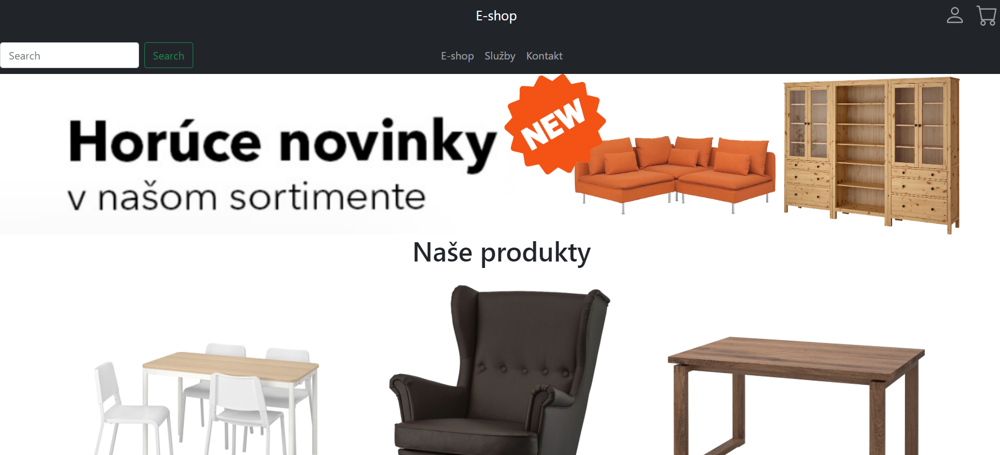
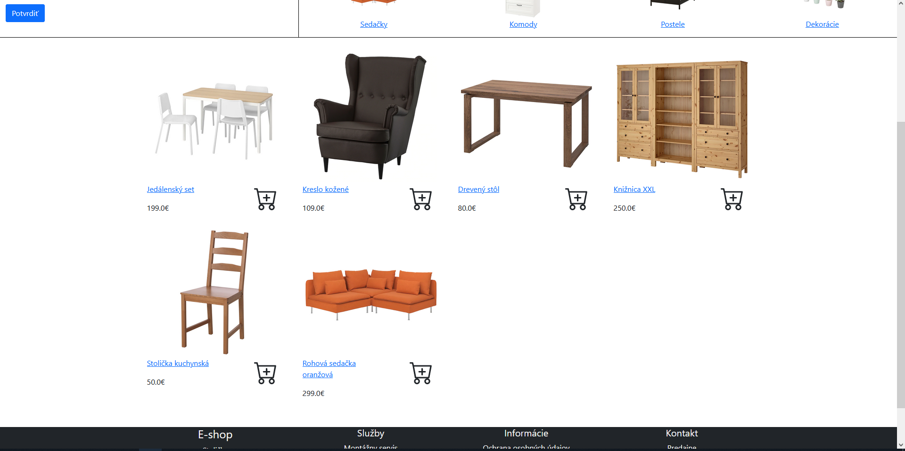
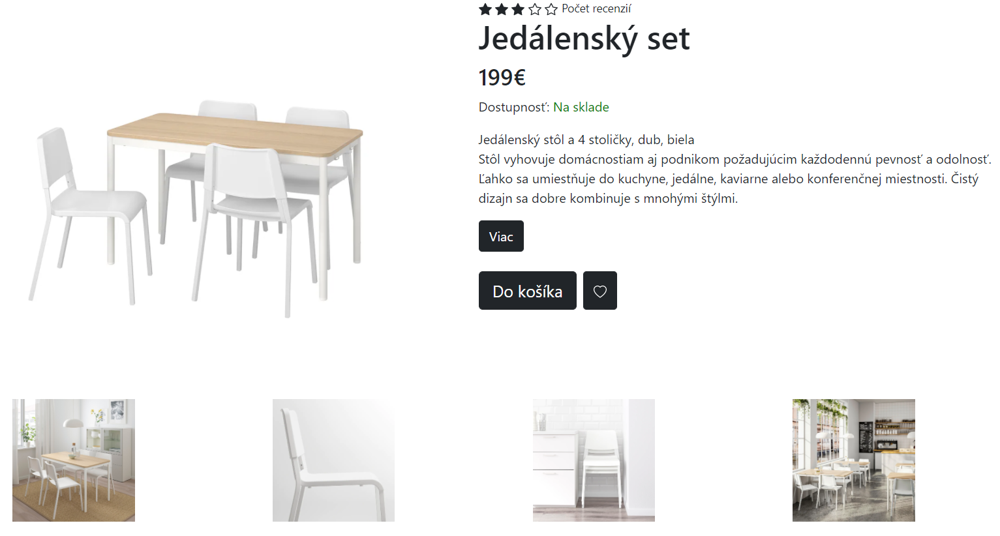
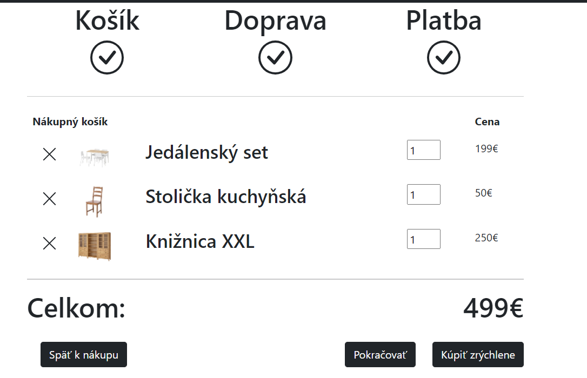
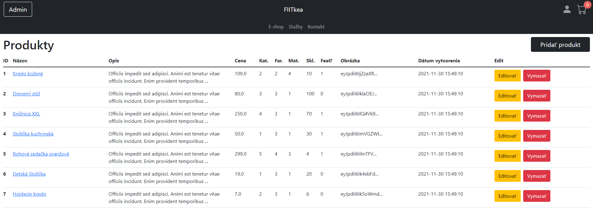

# eShop Web Application

This is an e-commerce web application developed as part of a Web Technologies class assignment. The application provides a comprehensive solution for managing products, user registration, shopping cart functionality, and administrative tasks. It is built using PHP with the Laravel framework, HTML, CSS, and JavaScript, and utilizes SQLite as the database.

## Features

The eShop web application includes the following features:

- Display an overview of products from selected categories
- Basic filtering options and pagination for product browsing
- Detailed product information and the ability to add products to the shopping cart
- Shopping cart functionality, including quantity changes, product removal, transport selection, payment options, delivery data entry, and order completion
- User/customer registration and login
- User/administrator login to the administrator interface
- Full-text search functionality for products
- Creation, modification, and deletion of products via the administrator interface

## Screenshots

## Technologies Used

The eShop web application utilizes the following technologies:

- PHP with Laravel framework
- HTML, CSS, and JavaScript
- SQLite database

## License

The eShop web application is open source and is available under the MIT License. Feel free to modify and distribute it as per the terms of the license.
 
